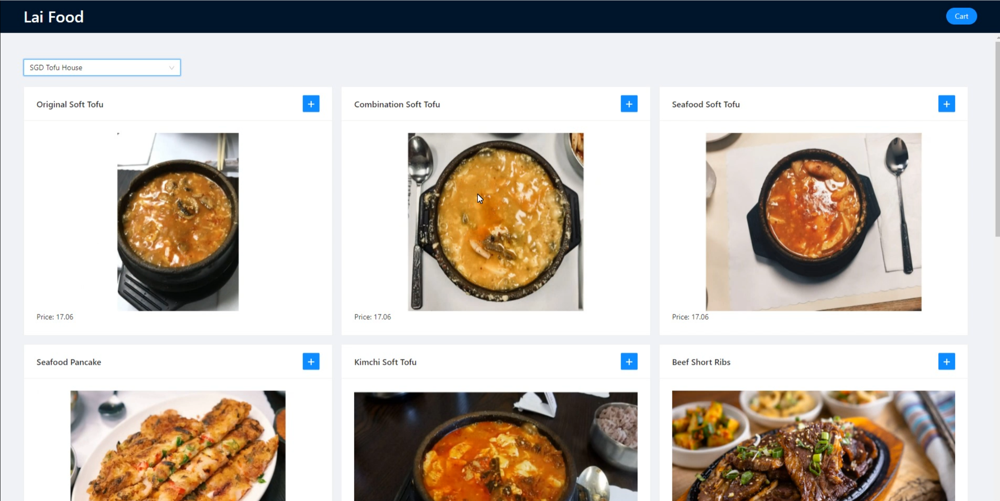
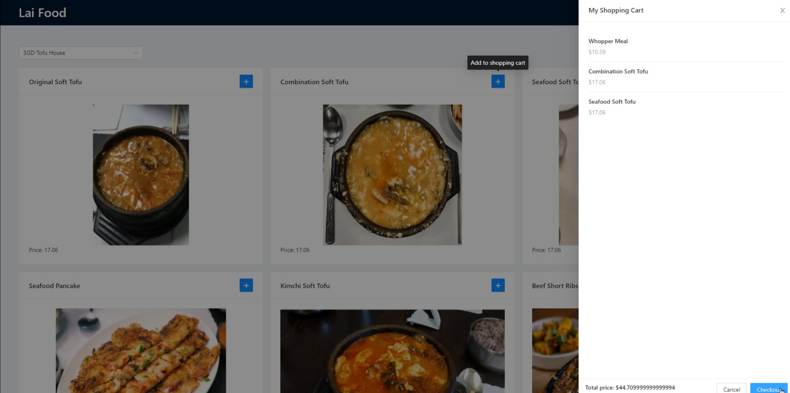

# OnlineOrder: A Full-Stack Spring and Hibernate based Online Food Ordering System

* Implemented REST APIs via Spring MVC including ordering, registration, and checkout etc.
* Utilized Hibernate to access and operate the MySQL database (e.g. menu, order etc.)
* Created a user-friendly client-side interface using React and Ant Design, allowing customers to
add food items to their shopping cart.
* Ensured the security of the application by implementing both authentication and authorization
through Spring security, protecting against malicious attacks, and limiting access to features such
as ordering and checkout to authorized users only
* Implemented the Spring framework core technologies to loosely decouple all components,
resulting in a flexible and scalable solution.

